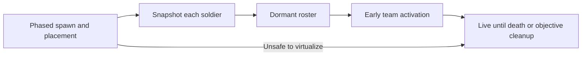

# AI virtualization investigation

2026-09-08. Investigation and broader design proposal based on the experimental addon and local GameSources. An initial optional implementation now exists; see [Dynamic AI Spawning](dynamic-ai-spawning.md) for its actual scope, controls and live-test procedure. The visibility-aware restoration, indirect-fire protection and fuller persistence described below remain future design work, not implemented guarantees. No live performance or multiplayer validation is claimed here; proposed distances and budgets below are experiments to tune, not proven settings.

## Recommendation

Use a persistent logical roster, with a record for every individual soldier, while only creating character entities where players can plausibly encounter them. Capture individual placement; activate an existing squad or a small, explicitly authored defensive team together. Preserve squad command relationships rather than independently flickering members on and off.

Start with concealed, stationary, untouched infantry. Seed their placement in bounded batches, save their actual settled positions, then virtualize eligible teams. Once activated for possible observation or contact, keep them present until normal objective cleanup in the first version. This tests the useful part of the idea without immediately requiring lossless restoration of wounded soldiers, inventories and combat behavior.

Keep exposed defenders and long-range threats live, using ordinary engine AI LOD where appropriate. Expand to repeated hibernation only if a full mission benchmark shows that one-time activation leaves too much AI present.

The central tradeoff is unavoidable: exact placement, no visible pop-in, and a strict live-AI cap cannot all be guaranteed when players can observe many places at once. Favor encounter continuity. Let necessary activation exceed a soft population target and reduce optional future reinforcement demand instead.

## What the current system already provides

These source anchors refer to the revision examined for this proposal; method names are more durable than line numbers.

| Existing behavior | Source | Consequence |
| --- | --- | --- |
| Area creation is scheduled in phases | Scripts/Game/IA_MissionInitializer.c:484 | Extend the current active-zone schedule; no need to populate the entire map at mission start. |
| Groups stagger by 600–5000 ms; individual soldiers by 100 ms | Scripts/Game/IA_AreaInstance.c:2993; Scripts/Game/IA_AI_Group.c:4771 | Useful plumbing, but many concurrent queues still need one shared work budget. |
| Each soldier gets a new random prefab and position scatter | Scripts/Game/IA_AI_Group.c:4783 | Initial spawning cannot serve unchanged as restoration. Store the actual selection. |
| Building teams walk into their posts; every living member must arrive on the correct floor | Scripts/Game/IA_BuildingGarrison.c:75; Scripts/Game/IA_AI_Group.c:4137 | Spawn completion is too early for a settled building snapshot. |
| Strength and replacement decisions depend on alive counts | Scripts/Game/IA_AreaInstance.c:1280,6598,6801 | Removing entities must not look like casualties or create replacement waves. |
| Town capture queries physical characters; base seize samples physical hostiles | Scripts/Game/IA_AreaMarker.c:252; Scripts/Game/IA_BaseAssaultObjective.c:201 | Logical strength alone will not stop premature capture. |
| Dynamic-site readiness expects a fulfilled living garrison budget | Scripts/Game/IA_DynamicSiteInstance.c:587; Scripts/Game/IA_DynamicSitePlacer.c:518 | Readiness needs to recognize a prepared dormant roster. |
| Existing Despawn is terminal group cleanup | Scripts/Game/IA_AI_Group.c:3616 | Add a separate virtualization lifecycle instead of recycling this method. |
| Current alive count falls back to authored squad size when unspawned | Scripts/Game/IA_AI_Group.c:1363 | A boolean spawned flag cannot represent dormant survivors accurately. |
| Connected players are sampled using world transforms | Scripts/Game/IA_SpawnPlacement.c:65 | Reuse the sampler; extend it for relevant observer types and approach prediction. |
| Incoming forces are prevented from reaching maximum AI LOD | Scripts/Game/IA_AI_Group.c:4681 | Respect the existing simulation owner; inbound movement must finish. |

The current spawn safety helpers check player distance and valid outdoor placement. Those are useful for reinforcement origins, but they do not prove a saved position is invisible. Restoration also must not use a helper that relocates an interior soldier outdoors.

## What the engine does and does not solve

The local SCR_AIGroup exposes dormant-member creation/deletion, lifecycle policies, and a spawn queue through the AI world. Its DespawnMembers path saves aggregate alive/dead counts and deletes characters. SpawnMembers uses the prefab slot list, and SpawnGroupMember derives positions from the group transform and formation, with placement adjustment. This is not an exact individual snapshot.

I&A's USSR group prefab has an explicitly empty member-prefab slot list (Prefabs/Groups/OPFOR/Group_USSR_Base.et:3). I&A adds its randomly selected soldiers manually; native AddAIEntityToGroup does not fill that list (SCR_AIGroup.c:1920). Native respawn therefore cannot simply reconstruct these I&A groups. Also, native OnEmpty invokes external listeners before its dormant-state guard (SCR_AIGroup.c:2442), so the addon must explicitly protect elimination bookkeeping during intentional member removal.

Scenario Framework also supports dynamic spawning. Bohemia's [Scenario Framework documentation](https://community.bistudio.com/wiki/Arma_Reforger:Scenario_Framework) describes retaining moved positions. The local SlotAI implementation stores one m_vPosition and reforms agents around it. That is insufficient evidence for restoring every individual's room, floor, heading or equipment.

The engine persistence APIs and AI group serializer offer a separate possible full-state route. They merit a small compatibility experiment before implementing repeated post-combat restoration, but require verified tracking, serialization coverage and reference restoration. Their existence does not establish that this addon can safely delete and recreate arbitrary soldiers today.

Choose one lifecycle owner. The I&A manager must coordinate with native lifecycle/budget behavior; independent native and addon spawn queues must not both recreate the same roster. Existing I&A manual character creation does not automatically become native queued restoration by enabling a group proximity policy.

Local engine evidence:

- D:/ReforgerGameSources/data/data007/scripts/Game/Entities/SCR_AIGroup.c:1657,2777,2864,2915 — formation creation, count-based restoration/deletion and lifecycle policy.
- D:/ReforgerGameSources/data/data007/scripts/Game/ScenarioFramework/Components/SCR_ScenarioFrameworkSlotAI.c:91,323 — single-position save and formation restoration.
- D:/ReforgerGameSources/data/data007/scripts/Game/generated/System/ObserversSystem.c — far observers for optics exist; a simple position/range query is not a complete visibility test.
- D:/ReforgerGameSources/data/data007/scripts/Game/generated/Plugins/Persistence/System/PersistenceSystem.c — tracked save/spawn and serialization interfaces; fidelity remains untested here.

## Capturing positions without recreating the original load spike

1. Prepare the logical roster for the current objective group. Give each soldier a stable addon identity independent of its entity or replication ID.
2. Seed a limited number of quiet sites or mutually interacting defensive teams. Reserve temporary live capacity before starting. Pause distant preparation when real gameplay needs that capacity.
3. Let native initialization and intended placement finish. For building garrisons, use the existing per-member arrival checks. For other stationary teams, require a bounded stable interval and no unresolved movement, mounting or spawn callbacks. A timeout keeps the team live; it is not proof of valid placement.
4. Record the actual world transform of every living soldier, including vertical position and orientation. Save its actual character prefab, resolved equipment/appearance where randomized, group identity, faction, role, high-level orders and building/post assignment. Release and later reacquire transient smart-action reservations through supported behavior; do not retain references to deleted objects.
5. Recheck observer proximity, possible visibility, player control and combat eligibility immediately before deletion. If any player approaches during preparation, keep the force live and finish initialization normally.
6. Finish the snapshot transaction and remove eligible member entities in bounded work slices. Retain the logical roster and site ownership. Do not award kills, trigger replacements or recreate a squad with a new identity.

Each exact transform is a desired restoration pose, not permission to clip through changed geometry. Validate the saved floor, support and body clearance. A parked vehicle, destroyed building or new obstacle can invalidate it. Prefer the original pose, then a small validated adjustment that preserves the same defensible location and floor. If that is impossible, retain the roster and use a concealed approach from a valid origin; do not silently snap an upstairs defender onto terrain or create it in front of a player.

The initial seed costs real spawning, initialization, pathfinding, replication and deletion, then another spawn at activation. Limit concurrent seed work and measure whether enough dormant time is recovered to repay that cost. Some posts already have validated authored positions; a later optimization could create their records directly, provided this preserves intended individual placement. Capture a site that shares cover reservations together so separate seed batches do not assign multiple teams to the same supposedly free post.

## Preventing pop-in

Visibility detection alone is insufficient. If an empty position is already visible when activation begins, spawning there a second later can still be obvious. Use early preparation and conservative exposure rules.

| Layer | Proposed behavior |
| --- | --- |
| Exposed force | Keep skyline sentries, rooftops, open roads and other long-range observation targets present. A town should retain a believable visible defense during reconnaissance. |
| Nearby activation | Activate every relevant team within a generous neighborhood, even behind walls or outside the player's current view direction. Use individual positions or team bounds, not just a group leader. |
| Approach prediction | Prepare along travel direction and possible reveal points before a hill crest, road bend or doorway exposes the team. Expand the lead for helicopters, HALO and other fast approaches. |
| Potential long-range observation | Use conservative exposure/terrain checks and appropriate observer positions; optics and elevated viewpoints can require a larger active region. Uncertain visibility favors leaving units present. |
| Combat continuity | Activate support around a contacted force, regardless of player distance. Never delete a soldier that can affect an ongoing encounter. |
| Retention | First version stays live after activation. A later repeatable version needs separate wake/sleep distances, a quiet interval, minimum live time and continuing visibility/contact vetoes. |

Use the union of all players' protected regions. One squad walking away must not unload enemies another squad is watching. Account for world-space eye/vehicle positions, aircraft altitude, supported remote cameras and GM possession. Camera reports from clients can conservatively request more protection, but missing reports must never authorize deletion; validate and rate-limit any reports used by the server.

For visibility work, first reject distant irrelevant cells cheaply, then spend a bounded number of traces on candidate teams. Sample the team's volume and several body heights. A single ray to a ground point can miss visible heads or a window. Treat terrain and solid building occlusion more confidently than foliage, smoke, doors, small props or a player's current facing. Being behind the current view cone is not enough: a player can turn instantly.

Estimate the preparation lead from measured tail latency:

    lead distance = closing speed × (check delay + queue wait + spawn/initialization time + replication allowance) + margin

The trigger must also include the team's extent and the relevant observation/engagement distance; this formula is the additional travel buffer, not the entire activation radius. Measure time until the client sees ready, responsive soldiers, not merely until the server creates entities. Preload required navigation/assets during preparation where supported.

Starting experiments for ordinary infantry could use a nearby wake radius around 700–1000 m, followed by larger exposure/aircraft regions. These values cannot protect unrestricted long-range optics by themselves. A repeatable later mode might sleep only outside 1200–1600 m after 90–180 seconds of verified quiet, with every other veto still applied. Tune from actual sightlines and measured latency rather than treating these as universal defaults.

An unexpected teleport or fast reveal can defeat prediction. Give the endangered team immediate queue priority. If its exact positions are already visibly empty, do not force a close, on-screen restoration: retain the roster, hold capture readiness as needed, and bring the same force from a concealed valid origin. Record this as a fallback and a missed preparation deadline. This intentionally sacrifices exact placement in a rare case to preserve a believable encounter.

## Population, combat and cleanup invariants

Use distinct per-soldier states: planned, seeding, dormant, activating, live, dead and retired. An optional later hibernating state covers repeat snapshots. A stable record can reference a current entity while live; it must not depend on that reference surviving deletion.

- Logical surviving strength includes dormant and activating soldiers exactly once. Physical live count measures created characters. Pending activation reserves capacity but does not create new enemy strength. Casualties change logical strength only through confirmed gameplay death.
- Capture must wait for relevant defender materialization, or explicitly account for dormant defenders using the same spatial eligibility as capture. Do not make a defender far outside the capture zone block it indefinitely. Never let absence caused by streaming grant progress.
- Site readiness can mean a complete, valid prepared roster. It must not incorrectly fail because that roster has been virtualized. Restoration does not pass through new-reinforcement registration and increment initial strength again.
- An observed, damaged, suppressed, fighting, recently firing or contacted team remains live. Also protect teams with moving/boarding members, player control, persistent attachments or explicit ownership by another system. The first version excludes these rather than guessing at a full state restore.
- Dormant characters cannot receive ordinary bullets or explosion damage because they do not exist. Leave artillery and its crews live, and activate relevant target areas before supported indirect-fire impacts when those events can be intercepted early enough. Otherwise keep affected areas live or exclude that scenario from the prototype. Waking after an explosion does not retroactively apply it.
- Initial experimental scope freezes stationary offscreen forces. Patrols, convoys and combat between non-player factions continue live; moving them through a simplified offline simulation would be a different feature.
- Repeated activation requests are idempotent. Reserve capacity before creating units, attach death listeners once, and reconcile partial creation against stable soldier IDs. A failed resource or group attachment gets bounded retry and an explicit recoverable error state; it must not become a kill or a duplicate replacement.
- AO completion, cancellation, site removal and mission shutdown retire owned records and invalidate generation tokens before cancelling callbacks. A stale callback must not resurrect a completed objective. Cleanup preserves existing protection for player-controlled actors.
- If a partial team has become observable, retain its successfully created members and complete it through safe placement. Do not roll back by deleting visible soldiers. If still safely concealed, rollback/retry may be possible after validation.

For a future repeatable mode, saving only health and position is insufficient. Verify magazine rounds, chamber state, inventory/ammo containers, wounds/bleeding/unconsciousness, faction/skill settings, leadership, orders, assignments, casualty identities and externally held references. Keep unsupported cases live. Treat a visual stance mismatch as acceptable only if collision and gameplay remain correct; do not claim exact restoration of an animation or behavior-tree execution state.

## How this enables heavier firefights

Track separate budgets for live characters, queued/reserved activation, temporary seed work and desired combat pressure. Schedule globally so overlapping area and reinforcement queues cannot each assume all remaining capacity is theirs. Include nonvirtualized actors when estimating total server load.

Priority should be immediate contact/visibility, predicted arrivals and threatened objectives, then distant preparation. Raise priority as a team's deadline approaches and reserve enough room to finish its coherent activation. Pause seeding and delay optional future waves before withholding existing defenders who should already be present. Initial per-soldier staggering can remain, but one manager must cap aggregate work across concurrent groups.

For illustration only, an AO with 300 logical soldiers might have 100 present and 200 dormant while players fight on one side. That does not establish that this server can sustain 100, or that 200 character deletions produce a proportional CPU gain: native LOD already reduces some distant work. When players split across all sides, most of the 300 may need to be present. Virtualization saves distant work; additional nearby combat still costs full simulation.

First hold the intended enemy force and reinforcement policy constant to measure savings. Only then spend verified headroom on higher nearby intensity. Otherwise changing both systems at once obscures whether the optimization helped. Measure over a full objective cycle: one-time activation can accumulate live troops as players scout more areas.

## Bounded implementation and validation path

1. Instrument existing behavior: live soldiers, logical force, native group dormancy where applicable, active AI LOD distribution, server frame-time tails, pending spawn work and time to complete group creation. Keep routine diagnostics behind the existing debug option.
2. Add explicit roster identity/state, lifecycle ownership and capture/readiness integration. Verify bookkeeping before deleting any gameplay characters.
3. Implement one concealed stationary garrison snapshot and exact restoration, default disabled. Use the existing manual individual spawn path as the integration point, with a separate restoration input that bypasses random selection/scatter. Keep vehicles, crews, airborne forces, HVTs, moving patrols and exposed posts outside scope.
4. Add a shared activation work budget, early proximity/approach protection and one-time activation retention. Continue to use native LOD for present soldiers. Native dormancy/persistence reuse should pass compatibility checks before replacing the custom restoration path.
5. Run a dedicated-server test with a second observing client, then a representative full objective. Compile and source checks cannot establish visual continuity or performance savings.

| Acceptance case | Required evidence |
| --- | --- |
| Quiet multi-floor garrison round trip | Same soldier records, prefabs, correct floors and valid world poses; functional grouping, movement and combat after restoration. |
| Continuous hilltop/binocular observation | Exposed posts stay present; distant silhouettes do not appear during a watched approach. |
| Fast helicopter/HALO arrival and supported teleport | Preparation finishes before reveal in expected routes; unexpected reveal uses the documented safe fallback. |
| Two squads approaching different sides | Either squad protects the defenders it can observe or engage. |
| Wound/kill, withdraw, return | No healing, ammunition reset, resurrected casualty or duplicate kill credit. In version one these troops remain live. |
| Mortar strike at a dormant area | Target-area policy prevents invisible immunity; no claim of success from post-impact activation. |
| Capture while a team is queued | Streaming absence grants no capture progress and does not create permanent blockage after recovery. |
| Cancel AO during seeding/restoration | No late soldiers, stale callbacks, duplicated groups or stranded snapshots after cleanup. |
| Full mission with scouting and overload | Meaningful reduction in live entities and improved server frame-time tails without unacceptable activation spikes or new reinforcement starvation. |

The first decision after that test is whether one-time activation provides enough sustained savings. If it does, retain the simpler lifecycle. If it does not, validate the engine persistence route or a narrowly scoped repeat snapshot format before expanding beyond untouched stationary infantry.
